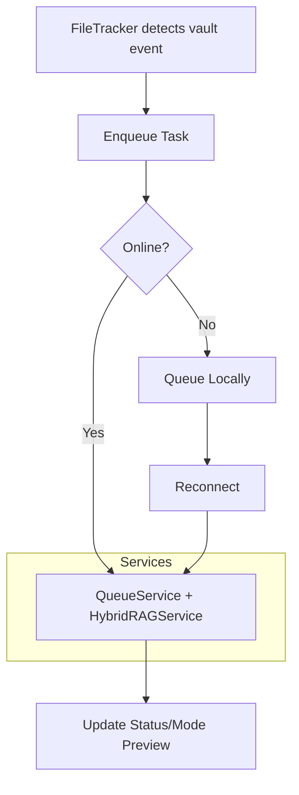

# ARCHITECTURE.md: Architectural Overview of Obsidian-RAG

This document outlines the high-level architecture of Obsidian-RAG, emphasizing its modular design, data flows, and extensibility points. Built as a TypeScript-based Obsidian plugin, it focuses on ingestion-only synchronization to Supabase (vector store) and Neo4j (graph database) for Hybrid RAG systems. For development setup, refer to [DEVELOPMENT.md](DEVELOPMENT.md).

## Design Principles
- **Privacy-First**: Defaults to Ollama for local embeddings; OpenAI as optional fallback. No data leaves the user's control.
- **Resilience**: Offline queuing with automatic reconciliation; retry mechanisms for failures.
- **Modularity**: Service-based architecture for easy testing and extension.
- **Isolation**: `project_name` scopes all DB operations to prevent vault mixing.
- **Ingestion-Only**: No querying within the plugin—prepare data for external tools like n8n or bots.
- **Event-Driven**: Uses an internal EventEmitter for loose coupling between components.

## High-Level Components
Obsidian-RAG is structured around the Obsidian Plugin API, with layers for settings, services, utils, and models.

### Directory Structure Recap
```
Obsidian-RAG/
├── main.ts                       # Plugin entry and lifecycle
├── settings/                     # Config UI and interfaces
├── services/                     # Core logic (DB, queue, sync)
├── utils/                        # Helpers (chunking, errors)
├── models/                       # Type definitions
├── scripts/                      # Dev utilities
├── sql/                          # DB schemas
├── tests/                        # Integration tests
└── manifest.json                 # Plugin metadata
```

### Key Layers
1. **Plugin Entry (main.ts)**:
   - Handles lifecycle: `onload` initializes services, registers events (e.g., vault changes via `this.app.vault.on`), and sets up commands.
   - `onunload`: Cleans up listeners and queues.
   - Exposes command palette actions (e.g., force sync, clear queue).

2. **Settings Layer**:
   - **Settings.ts**: Defines `ObsidianRAGSettings` interface with defaults (e.g., API keys, exclusions, modes).
   - **SettingsTab.ts**: Renders UI with tabs for Supabase/Neo4j config, connection tests, resets, and previews. Includes status indicators and donation QR.

3. **Services Layer** (Core Business Logic):
   - **EmbeddingService.ts**: Generates embeddings via Ollama (default) or OpenAI with client-side rate limiting and padding to 768-d vectors.
   - **SupabaseService.ts**: Manages vector store ops—initializes the `documents` and `obsidian_file_status` tables, serializes per-file writes, and exposes helpers for deletes or metadata lookups.
   - **Neo4jService.ts**: Upserts graph nodes/relationships for documents, chunks, entities, and relationships, and enforces uniqueness constraints scoped by `project_name`.
   - **QueueService.ts**: Custom FIFO queue that uses `TextSplitter`, `MetadataExtractor`, and `HybridRAGService` to execute vector and/or graph stages depending on the configured `SyncMode`. Emits progress via `EventEmitter` for status widgets.
   - **HybridRAGService.ts**: Enforces hybrid execution order (vector-first, graph-first, or parallel) and dual-write requirements.
   - **OfflineQueueManager.ts**: Stores serialized operations in vault storage, retries with exponential backoff, and uses `SyncFileManager` or Supabase APIs to reconcile.
   - **InitialSyncManager.ts**: Scans the vault in batches, respects exclusion filters, listens for queue completion events, and throttles to avoid blocking Obsidian.
   - **SyncDetectionManager.ts**: Waits for a quiet period after Obsidian Sync/remote changes before bootstrapping the initial sync.
   - **SyncFileManager.ts**: Creates and maintains `_obsidianragsync.md`, backs it up, and records device-level sync metadata for multi-device consistency.
   - **MetadataExtractor.ts** & **EntityExtractor.ts**: Normalize YAML/frontmatter into `DocumentMetadata`, optionally run LLM/Ollama-powered entity extraction with heuristics.
   - **EventEmitter.ts**: Lightweight pub/sub utility backing queue progress, error handling, and Mode Preview updates.

4. **Observability & UX**:
   - **StatusManager.ts**: Updates the status bar item with plugin state transitions (initializing, waiting for sync, ready, error).
   - **ModePreviewManager.ts**: Records the last few sync outcomes, renders summaries/ribbon buttons, and exposes modal history plus summaries in `SettingsTab.ts`.
   - **NotificationManager.ts**: Displays progress notices during long-running operations (initial sync, queue retries) and integrates with Obsidian toasts.
   - **SettingsTab.ts**: Presents Supabase/Neo4j credentials, hybrid controls, Mode Preview summaries, and vault initialization/reset helpers alongside connection tests.

5. **Utils Layer**:
   - **TextSplitter.ts**: Chunks notes with overlap, handles YAML extraction and preprocessing.
   - **ErrorHandler.ts**: Centralized logging, retries, and notifications.
   - **FileTracker.ts**: Hashes metadata for change detection.
   - **NotificationManager.ts**: In-app toasts, progress bars, and overlays (e.g., sync graph).

6. **Models Layer**:
   - TypeScript interfaces for consistency: `DocumentChunk.ts` (chunk metadata with file_id, lines), `ProcessingTask.ts` (queue items), `SyncModels.ts` (DB schemas).

## Data Flow
### Sync Process (Hybrid Mode Example)
1. **Trigger**: `FileTracker` observes a vault event (create/update/delete) or the user invokes a command. The plugin builds a `ProcessingTask` and hands it to `QueueService`.
2. **Preflight**: `SyncDetectionManager` and `InitialSyncManager` gate the first wave of tasks until Obsidian Sync settles and the vault-level `_obsidianragsync.md` file is initialized through `SyncFileManager`.
3. **Queue Processing**:
   - Extract metadata (`MetadataExtractor`) and optionally request entities (`EntityExtractor`).
   - Split text into chunks (`TextSplitter`).
   - Generate embeddings (`EmbeddingService`).
   - `HybridRAGService` decides whether to run vector writes, graph writes, or both and in which order.
   - Vector stage: Upsert to Supabase (`SupabaseService`) with per-file serialization, tag syncing, and hash comparisons.
   - Graph stage: `Neo4jService` upserts documents, chunk nodes, entities, and relationships while pruning orphaned chunks.
4. **Offline Handling**: If connectivity fails, the `OfflineQueueManager` captures the pending operation, persists it to disk, and retries using Supabase/SyncFileManager when back online.
5. **Status/Telemetry**: `StatusManager`, `ModePreviewManager`, and `NotificationManager` subscribe to queue events via `EventEmitter` to refresh the status bar, ribbon icon, and modal summaries.
6. **Error/Retry**: `ErrorHandler` logs context-rich metadata, surfaces notices, and the queue applies exponential backoff before retrying tasks.

Mermaid Diagram for Sync Flow:


### Extensibility Points
- **Custom Embeddings**: Extend `EmbeddingService` for new providers.
- **Entity Extraction**: Override `MetadataExtractor` for advanced NLP (e.g., integrate spaCy via worker).
- **Modes**: Add custom hybrid strategies in settings (e.g., graph-first).
- **Integrations**: Hook into events for plugins like n8n—e.g., emit webhooks on sync complete.
- **Testing Mocks**: Services are injectable; mock DB clients for isolated tests.

## Performance Considerations
- **Batching**: Initial sync uses batches to avoid overwhelming DBs.
- **Indexing**: Auto-creates Supabase vector indexes and Neo4j constraints.
- **Scalability**: Queue limits parallelism; monitor for large vaults.
